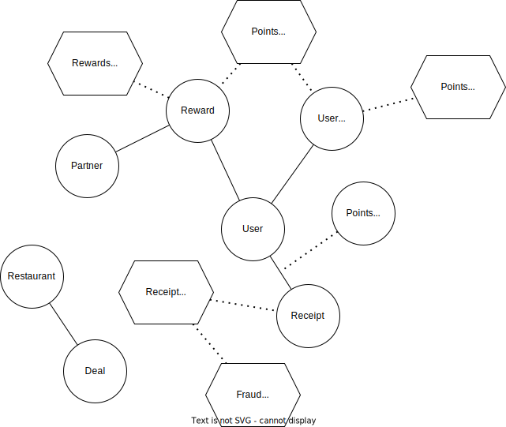

## Restaurant Rewards App

Scenario: Restaurant Rewards Mobile App

You are tasked with designing the domain model for a Restaurant Reward Mobile App. The app 
encourages users to scan receipts from restaurants they visit, earning points for each 
receipt scanned. Special deals give users the chance to earn double or triple points when 
they visit certain restaurants on specific days.

Users accumulate points that they can exchange for gift cards at different partner stores, 
like Walmart, Amazon and Mercado Libre. 

### Domain Model

